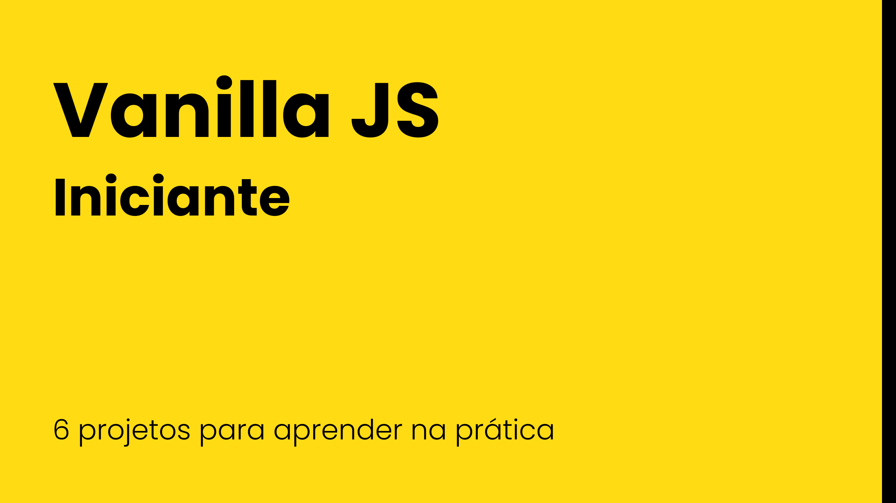

# Bem-vindo!!! 💪🎊🎉

## Organização do repo

Esse repositório é formado de projetos de Vanilla Javascript organizados de forma progressiva, para você evoluir a cada novo projeto concluído.

Os projetos são escritos de uma forma para te guiar no desenvolvimento dele, todos tem as seguintes informações:

1. Objetivo claro e descritivo;
1. Lista de tarefas com cada um dos passos que devemos cumprir para que o nosso projeto seja considerado concluído;
1. Conteúdo de estudo, onde vai conter todas as informações técnicas de tudo que é indicado utilizar no desenvolvimento do projeto;
1. Lista de desafios contendo complementos interessantes para o seu projeto ficar mais robusto (esse não vem com material de estudo 😈 );
1. Ferramentas utilizadas para a criação do projeto;

## Todos os projetos

1. [Carousel: Meu time, comentários, notas, propagandas](./01-carousel)
1. Em Breve
1. Em Breve
1. Em Breve
1. Em Breve
1. Em Breve
